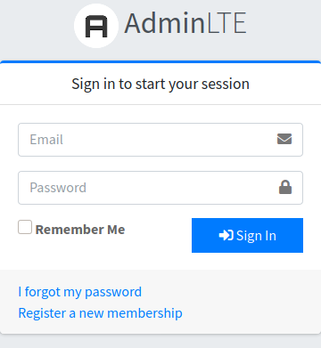

# Easy AdminLTE integration with Laravel

[](https://packagist.org/packages/jeroennoten/Laravel-AdminLTE)
[](https://packagist.org/packages/jeroennoten/Laravel-AdminLTE)
[](https://github.com/jeroennoten/Laravel-AdminLTE/actions)
[](https://scrutinizer-ci.com/g/jeroennoten/Laravel-AdminLTE)
[](https://scrutinizer-ci.com/g/jeroennoten/Laravel-AdminLTE)
[](https://styleci.io/repos/38200433)

This package provides an easy way to quickly set up [AdminLTE v3](https://adminlte.io/themes/v3/) with Laravel 6 or higher. It has no requirements and dependencies besides Laravel, so you can start building your admin panel immediately. The package provides a Blade template that you can extend and advanced menu configuration possibilities. A replacement for the `make:auth` Artisan command that uses AdminLTE styled authentication views instead of the default Laravel ones is also included.

If you want to use an older Laravel or AdminLTE version, review the following package versions:
- Version **1.x**:
  These versions supports Laravel 5 and include AdminLTE v2
- Version **2.x** or branch **laravel6-adminlte2**:
  These versions supports Laravel 6 or higher and include AdminLTE v2

## Table of Contents

1. [Requirements](#1-requirements)
2. [Installation](#2-installation)
3. [Updating](#3-updating)
4. [Usage](#4-usage)
5. [Artisan Console Commands](#5-artisan-console-commands)
   1. [The `adminlte:install` Command](#51-the-adminlteinstall-command)
      1. [Command Options](#511-command-options)
   2. [The `adminlte:plugins` Command](#52-the-adminlteplugins-command)
      1. [Command Options](#521-command-options)
   3. [The `adminlte:update` Command](#53-the-adminlteupdate-command)
   4. [The `adminlte:status` Command](#54-the-adminltestatus-command)
   5. [Authentication Views](#55-authentication-views)
      1. [Using the Authentication Views Manually](#551-using-the-authentication-views-manually)
6. [Basic Configuration](#6-basic-configuration)
   1. [Title](#61-title)
   2. [Favicon](#62-favicon)
   3. [Logo](#63-logo)
   4. [User Menu](#64-user-menu)
      1. [Example Code of User Image and Description](#641-example-code-of-user-image-and-description)
   5. [URLs](#65-urls)
7. [Layout and Styling Configuration](#7-layout-and-styling-configuration)
   1. [Layout](#71-layout)
      1. [Responsive Usage](#711-responsive-usage)
   2. [Classes](#72-classes)
      1. [Authentication Views Classes](#721-authentication-views-classes)
      2. [Admin Panel Classes](#722-admin-panel-classes)
   3. [Sidebar](#73-sidebar)
   4. [Control Sidebar (Right Sidebar)](#74-control-sidebar-right-sidebar)
8. [Menu Configuration](#8-menu-configuration)
   1. [Menu](#81-menu)
   2. [Adding a Search Input](#82-adding-a-search-input)
   3. [Custom Menu Filters](#83-custom-menu-filters)
   4. [Menu Configuration at Runtime](#84-menu-configuration-at-runtime)
      1. [Config on Service Provider](#841-config-on-service-provider)
9. [Other Configuration](#9-other-configuration)
   1. [Plugins](#91-plugins)
      1. [Pace Plugin Configuration](#911-pace-plugin-configuration)
   2. [Laravel Mix](#92-laravel-mix)
   3. [Livewire](#93-livewire)
10. [Translations](#10-translations)
    1. [Menu Translations](#101-menu-translations)
11. [Customize Views](#11-customize-views)
12. [Issues, Questions and Pull Requests](#12-issues-questions-and-pull-requests)


## 1. Requirements

The current package requirements are:

- Laravel >= 6.x
- PHP >= 7.2


## 2. Installation

> **Note:** the next steps are valid for a fresh installation procedure, if you are updating the package, refers to the [Updating](#3-updating) section.

1. On the root folder of your Laravel project, require the package using composer:

   ```sh
   composer require jeroennoten/laravel-adminlte
   ```

2. **(For Laravel 7+ only)** If you want to install the authentication scaffolding, then require the `laravel/ui` package using composer:

   ```sh
   composer require laravel/ui
   php artisan ui vue --auth
   ```

   > **Note:** it is a recommendation to read the [Laravel Authentication Documentation](https://laravel.com/docs/7.x/authentication) for details about the authentication scaffolding.

3. Finally, install the required package resources using the next command:

   ```sh
   php artisan adminlte:install
   ```

   > You can use **--force** option to overwrite existing files.
   >
   > You can use **--interactive** option to be guided through the process and choose what you want to install.
   > 
   > You can check the installation status of the package resources with the command `php artisan adminlte:status`


## 3. Updating

1. First, update the package with the next composer command:

   ```sh
   composer update jeroennoten/laravel-adminlte
   ```

2. Then, update the required AdminLTE assets resources

   > **Note:** if you are using AdminLTE for Laravel 5.x and are upgrading to Laravel 6 version, first delete the folder adminlte inside your `public/vendor` directory.

   In order to publish the new AdminLTE assets, execute the next command:

   ```sh
   php artisan adminlte:update
   ```

3. If you have [published](#11-customize-views) and modified the default `master.blade.php` file, `page.blade.php` file or any other view provided with this package, you may need to update them too. Please, note there could be huge updates on these views, so it is highly recommended to backup your files previosuly. To update the views, you may follow next steps:

   - Make a copy (or backup) of the views you have modified, those inside the folder `resources/views/vendor/adminlte`.

   - Publish the new set of views, using the `--force` option to overwrite the existing files.

     ```sh
     php artisan adminlte:install --only=main_views --force
     ```

   - Compare the new installed views with your backup files and redo the modifications you previously did to those views.

4. From time to time, new configuration options may be added or default values may be changed, so it is also a recommendation to verify and update the package config file if needed. To update the configuration, you may follow next steps:

   - Make a copy (or backup) of your current package configuration file, the `config/adminlte.php` file.

   - Now, publish the new package configuration file and accept the overwrite warning (or use `--force` option to avoid the warning).

     ```sh
     php artisan adminlte:install --only=config
     ```

   - Compare with your backup configuration file and redo the modifications you previously made.


## 4. Usage

To use the blade template provided by this package, just create a new blade file and extend the layout with `@extends('adminlte::page')`. The template yields the following main sections:

- `title`: to fill the content of the `<title>` tag.
- `content_header`: to fill the title of the page (above the main content).
- `content`: to fill all of the page's main content.
- `footer`: to fill the content of the page footer.
- `right-sidebar`: to fill the content of the right (control) sidebar.
- `css`: to add extra stylesheets (inside the `<head>` tag).
- `js`: to add extra javascript (just before the `</body>` tag).

In fact, all the mentioned sections are optional. As a basic example, your most common blade template could look like the following one:

```blade
@extends('adminlte::page')

@section('title', 'Dashboard')

@section('content_header')
    <h1>Dashboard</h1>
@stop

@section('content')
    <p>Welcome to this beautiful admin panel.</p>
@stop

@section('css')
    <link rel="stylesheet" href="/css/admin_custom.css">
@stop

@section('js')
    <script> console.log('Hi!'); </script>
@stop
```

Now, and as usual, you just return this view from a controller. It is a recommendation to check out [AdminLTE v3](https://adminlte.io/themes/v3/) to find out how to build beautiful content for your admin panel. As a preview, the next image shows what you can get with the previous blade template:


## 5. Artisan Console Commands

This package provides some artisan commands in order to manage its resources. These commands are explained in the next sections. First, we going to give a little summary of the available resources, they are distinguished by a key name:

- __`assets`__: The set of AdminLTE required assets, including dependencies like `Bootstrap` and `jQuery`.
- __`config`__: The package configuration file.
- __`translations`__: The set of translations files used by the package.
- __`auth_views`__: A set of AdminLTE styled authentication views to replace the Laravel default ones.
- __`basic_views`__: A home blade view that shows a basic template usage.
- __`basic_routes`__: Routes definitions for the authentication scaffolding.
- __`main_views`__: The set of package blade views that, in conjunction, provides the main layout you usually will extend.

### 5.1 The `adminlte:install` Command

You can install all the required and some additional package resources using the `php artisan adminlte:install` command. Without any option it will install the AdminLTE package assets, the configuration file and the translations.
You can also install the package **Authentication Views** adding the `--type=enhanced` option, or additional to the Authentication Views also the package **Basic Views** and **Routes** adding the `--type=full` option to the command.

#### 5.1.1 Command Options

- `--force`: Use this option to force the overwrite of any existing files by default.

- `--type=`: Use this option to set the installation type, the available types are: **basic** (the default value), **enhanced** or **full**.

- `--only=*`: Use this option to install only specific resources, the available resources are: **assets**, **config**, **translations**, **auth_views**, **basic_views**, **basic_routes** or **main_views**. This option can not be used with the `--with` option. Also, you can use this option multiple times, for example:
  ```sh
  php artisan adminlte:install --only=config --only=main_views
  ```

- `--with=*`: Use this option to install with additional resources, the available resources are: **main_views**, **auth_views**, **basic_views** or **basic_routes**. This option can be used multiple times, examples:
  ```sh
  php artisan adminlte:install --with=auth_views --with=basic_routes
  php artisan adminlte:install --type=full --with=main_views
  ```

- `--interactive` : Use this to enable be guided through the installation process and choose what you want to install.

### 5.2 The `adminlte:plugins` Command

If you won't use the content delivery network (`CDN`) to include new plugins, you are able to manage some optional plugins with the `php artisan adminlte:plugins` command.
You can **list**, **install** or **remove** all the available plugins at once or some specifics plugins. It is recommended to first check wich plugins are available executing the command `php artisan adminlte:plugins` (the output of this command is similar to the one explained for the [adminlte:status command](#54-the-adminltestatus-command)). Note that after the plugin is installed locally, you still need to setup it on the configuration file in order to use it, refer to the [Plugins](#91-plugins) section to checkout how to configure a plugin. Here are some examples that helps to explain the command options:

- List the status of all the available plugins:
  ```sh
  php artisan adminlte:plugins
  php artisan adminlte:plugins list
  ```
- List the status of the specified plugins:
  ```sh
  php artisan adminlte:plugins --plugin=datatables --plugin=select2
  ```
- Install all the available plugins:
  ```sh
  php artisan adminlte:plugins install
  ```
- Install only Pace Progress & Select2 plugins:
  ```sh
  php artisan adminlte:plugins install --plugin=paceProgress --plugin=select2
  ```
- Remove all the available plugins:
  ```sh
  php artisan adminlte:plugins remove
  ```
- Remove only Select2 plugin:
  ```sh
  php artisan adminlte:plugins remove --plugin=select2
  ```

#### 5.2.1 Command Options

 - `operation`: The type of the operation: **list** (default), **install** or **remove**.
 - `--plugin=*`: Use this option to apply the operation only over the specified plugins, the value of the option should be a plugin key. The option can be used multiple times.
 - `--force`: Use this option to force the overwrite of existing files.
 - `--interactive`: Use this option to enable be guided through the operation process and choose what you want to do on each step.

### 5.3 The `adminlte:update` Command

This command is only a shortcut for `php artisan adminlte:install --force --only=assets`.

> **Note:** this command will only update the AdminLTE assets located on the `public/vendor` folder. It will not update any other package resources, refer to section [Updating](#3-updating) to check how to make a complete update.

### 5.4 The `adminlte:status` Command

This command is very useful to check the package resources installation status, to run it execute the command:

```sh
php artisan adminlte:status
```

Once complete, it will display a table with all the available package resources and they installation status. The status can be one of the nexts:

- **Installed**: This means that the resource is installed and matches with the package resource.

- **Mismatch**: This means that the installed resource mismatch the package resource. This can happen due to an update available or when you have made some modifications on the installed resource.

- **Not Installed**: This means that package resource is not installed.

The table also shows a column which tells what resources are required for the package to work correctly. So, for these packages you should read **Installed** or **Mismatch** on the status column, otherwise the package won't work.

### 5.5 Authentication Views

> **Note:** this is only available for Laravel 5.2 or higher versions.

> **Note:** from Laravel 7, the authentication views are part of the `laravel/ui` package. So it is recommended to read [Laravel Authentication Documentation](https://laravel.com/docs/7.x/authentication) before proceeding.

This package provides the following command to replace the Laravel default authentication views (those inside the folder `resources/views/auth`) with a set of AdminLTE styled views.

```sh
php artisan adminlte:install --only=auth_views
```

By default, the provided login view contains a link to the registration and password reset views. If you don't want a registration or password reset form, set the `register_url` or `password_reset_url` setting to `null` on the `adminlte.php` configuration file and the respective link will not be displayed.

#### 5.5.1 Using the Authentication Views Manually

In case you want to use the package authentication views manually, you can create the following files and only add one line to each one of these files:

- _resources/views/auth/login.blade.php_:
  ```blade
  @extends('adminlte::auth.login')
  ```
- _resources/views/auth/register.blade.php_
  ```blade  
  @extends('adminlte::auth.register')
  ```
- _resources/views/auth/verify.blade.php_
  ```blade
  @extends('adminlte::auth.verify')
  ```
- _resources/views/auth/passwords/confirm.blade.php_
  ```blade
  @extends('adminlte::auth.passwords.confirm')
  ```
- _resources/views/auth/passwords/email.blade.php_
  ```blade
  @extends('adminlte::auth.passwords.email')
  ```
- _resources/views/auth/passwords/reset.blade.php_
  ```blade
  @extends('adminlte::auth.passwords.reset')
  ```


## 6. Basic Configuration

In order to change the package configuration, the configuration file should be published. So if you don't see the `adminlte.php` file inside the `config` folder, then publish the configuration file with the next command:

```sh
php artisan adminlte:install --only=config
```

Now, you are able to edit the `config/adminlte.php` file to configure the title, layout, menu, URLs etc. On the next sections, we going to review all the available configuration options. Let starts with the most basic ones.

### 6.1 Title

This is the default title for your admin panel, this goes into the title tag of your page. However, you can override it per page with the available title section. Optionally, you can also specify a title prefix and/or postfix.

The following config options are available:

- __`title`__: The default title.
- __`title_prefix`__: The title prefix.
- __`title_postfix`__: The title postfix.

### 6.2 Favicon

Favicons could be used easily. There are two different ways to do this. Take in mind that all the favicons should be placed in the `public/favicons/` folder. The next two combinations determines how the favicons will be used:

- __`['use_ico_only' => true, 'use_full_favicon' => false]`__

  Whit the previous configuration, the file `public/favicons/favicon.ico` will be used.

- __`['use_ico_only' => false, 'use_full_favicon' => true]`__

  Whit the previous configuration, multiple favicon files located on the `public/favicons/` folder will be used. The current code to use multiple favicons is the next one:

  ```blade
  <link rel="shortcut icon" href="{{ asset('favicons/favicon.ico') }}"/>
  <link rel="apple-touch-icon" sizes="57x57" href="{{ asset('favicons/apple-icon-57x57.png') }}">
  <link rel="apple-touch-icon" sizes="60x60" href="{{ asset('favicons/apple-icon-60x60.png') }}">
  <link rel="apple-touch-icon" sizes="72x72" href="{{ asset('favicons/apple-icon-72x72.png') }}">
  <link rel="apple-touch-icon" sizes="76x76" href="{{ asset('favicons/apple-icon-76x76.png') }}">
  <link rel="apple-touch-icon" sizes="114x114" href="{{ asset('favicons/apple-icon-114x114.png') }}">
  <link rel="apple-touch-icon" sizes="120x120" href="{{ asset('favicons/apple-icon-120x120.png') }}">
  <link rel="apple-touch-icon" sizes="144x144" href="{{ asset('favicons/apple-icon-144x144.png') }}">
  <link rel="apple-touch-icon" sizes="152x152" href="{{ asset('favicons/apple-icon-152x152.png') }}">
  <link rel="apple-touch-icon" sizes="180x180" href="{{ asset('favicons/apple-icon-180x180.png') }}">
  <link rel="icon" type="image/png" sizes="16x16" href="{{ asset('favicons/favicon-16x16.png') }}">
  <link rel="icon" type="image/png" sizes="32x32" href="{{ asset('favicons/favicon-32x32.png') }}">
  <link rel="icon" type="image/png" sizes="96x96" href="{{ asset('favicons/favicon-96x96.png') }}">
  <link rel="icon" type="image/png" sizes="192x192"  href="{{ asset('favicons/android-icon-192x192.png') }}">
  <link rel="manifest" href="{{ asset('favicons/manifest.json') }}">
  <meta name="msapplication-TileColor" content="#ffffff">
  <meta name="msapplication-TileImage" content="{{ asset('favicons/ms-icon-144x144.png') }}">
  ```

### 6.3 Logo

The logo is displayed at the upper left corner of your admin panel. You can use basic `HTML` code here if you want a simple text logo with a small image logo (e.g. 50 x 50 pixels), or you can use two images: one big (e.g. 210 x 33 pixels) and one small (e.g. 50 x 50 pixels). You can also change the sizes of the images and the alternate text for both logos. The available option are:

- __`logo`__: The text logo content, can use `HTML` code.
- __`logo_img`__: The path to the small logo image. The recommend size is: _50x50px_
- __`logo_img_class`__: Extra classes for the small logo image.
- __`logo_img_xl`__: The path to the large logo image, if you set a img url here, then it will replace the text & small logo with one big logo. When the sidebar is collapsed it will displays only the small logo. The recommend size is: _210x33px_
- __`logo_img_xl_class`__: Extra classes for the large logo image.
- __`logo_img_alt`__: The alternate text for the logo images.

### 6.4 User Menu

The user menu is displayed at the upper right corner of your admin panel. The available options for the user menu are:

- __`usermenu_enabled`__

  Whether to enable the user menu instead of the default logout button.

- __`usermenu_header`__

  Whether to enable the header section inside the user menu.

- __`usermenu_header_class`__

  Extra classes for the header section inside the user menu.

- __`usermenu_image`__

  Whether to enable the user image for the usermenu & lockscreen.

  > **Important:** for this feature, you will need to add an extra function named `adminlte_image()` inside the `User` model, usually located on the `app/User.php` file. The recommend image size is: _160x160px_.

- __`usermenu_desc`__

  Whether to enable the user description for the usermenu.

  > **Important:** for this feature, you will need to add an extra function named `adminlte_desc()` inside the `User` model, usually located on the `app/User.php` file.

- __`usermenu_profile_url`__

  Whether to enable if the user profile url can be set dynamically for the user instead of using the config option `profile_url`.

  > **Important:** for this feature, you need to add an extra function named `adminlte_profile_url()` inside the `User` model. The return value should be a string, not a route or url.

#### 6.4.1 Example Code of User Image and Description

Here you have an example code for the `User` model with the custom image, description and profile url functions.

```php
class User extends Authenticatable
{
    …

    public function adminlte_image()
    {
        return 'https://picsum.photos/300/300';
    }

    public function adminlte_desc()
    {
        return 'That\'s a nice guy';
    }

    public function adminlte_profile_url()
    {
        return 'profile/username';
    }
}
```

### 6.5 URLs

The next configuration options provides a way to setup the urls for the login, register and other links of the admin panel. You can change your dashboard, logout, login and register URLs.

- __`use_route_url`__

  Whether to use `route()` instead of the `url()` Laravel method to generate the urls.

- __`dashboard_url`__

  Changes the dashboard/logo URL. This URL will be used, for example, when you click on the upper left logo.

- __`logout_url`__

  Changes the logout button URL. This URL will be used when you click on the logout button.

- __`logout_method`__

  Changes the logout send method, the available options are: `GET`, `POST` & `null` (Laravel default).

  > **Note:** the logout URL automatically sends a `POST` request in Laravel 5.3 or higher.

- __`login_url`__

  Changes the login URL. This URL will be used when you click on the login button.

- __`register_url`__

  Changes the register URL. Set this option to `false` to hide the register link shown on the login view.

- __`password_reset_url`__

  Changes the password reset URL. This url should point to the view that displays the password reset form. Set this option to `false` to hide the password reset link shown on the login view.

- __`password_email_url`__

  Changes the password email URL. This url should point to the view that displays the send reset link form.

- __`profile_url`__

  Changes the user profile URL. When not `false`, it will displays a button in the user menu.


## 7. Layout and Styling Configuration

The next set of configuration options enables you to change the layout and style of your admin panel.

### 7.1 Layout

It's possible to change the admin panel layout, you can use a top navigation (navbar) only layout, a boxed layout with sidebar, and also you can enable a fixed mode for the sidebar, the navbar or the footer.

> **Important:** Currently, you cannot use a boxed layout with a fixed navbar or a fixed footer. Also, do not enable `layout_topnav` and `layout_boxed` at the same time. Anything else can be mixed together.

The following config options are available:

- __`layout_topnav`__

  Enables/Disables the top navigation only layout, this will remove the sidebar and put your links at the top navbar. Can't be used with `layout_boxed`.

- __`layout_boxed`__

  Enables/Disables the boxed layout that stretches width only to 1250px. Can't be used with `layout_topnav`.

- __`layout_fixed_sidebar`__

  Enables/Disables the fixed sidebar mode. Can't be used with `layout_topnav`.

- __`layout_fixed_navbar`__

  Enables/Disables the fixed navbar (top navigation) mode, here you can set to `true` or an `array` for responsive usage. Can't be used with `layout_boxed`.

- __`layout_fixed_footer`__

  Enables/Disables the fixed footer mode, here you can set `true` or an `array` for responsive usage. Can't be used with `layout_boxed`.

#### 7.1.1 Responsive Usage

When using an array on the `layout_fixed_navbar` or `layout_fixed_footer` configuration options, you can disable or enable the fixed layout for specific viewport sizes.

The following keys are available to use inside the array, you can set them to `true` or `false`:

Key  | Description
-----|------------
`xs` | Represent screens from 0px to 575.99px width
`sm` | Represent screens from 576px to 767.99px width
`md` | Represent screens from 768px to 991.99px width
`lg` | Represent screens from 992px to 1199.99px width
`xl` | Represent screens from 1200px or more width

__Examples:__

- `['xs' => true, 'lg' => false]`:

  The element will be fixed from mobile to small tablet (<= 991.99px).

- `['lg' => true]`:

  The element will be fixed starting from desktop (>= 992px).

- `['xs' => true, 'md' => false, 'xl' => true]`:

  The element will be fixed for mobile (<= 767.99px) and extra large desktops (>= 1200px) but not for a small tablet and normal desktop (>= 768px & <= 1199.99px)

### 7.2 Classes

#### 7.2.1 Authentication Views Classes

You can change the look and behavior of the authentication views (login, register, email verification, etc). The following config options are available:

- __`classes_auth_card`__

  Extra classes for the card box. Classes will be added to element `div.card`.

- __`classes_auth_header`__

  Extra classes for the card box header. Classes will be added to element `div.card-header`.

- __`classes_auth_body`__

  Extra classes for the card box body. Classes will be added to element `div.card-body`.

- __`classes_auth_footer`__

  Extra classes for the card box footer. Classes will be added to element `div.card-footer`.

- __`classes_auth_icon`__

  Extra classes for the input icons (font awesome icons related to input fields).

- __`classes_auth_btn`__

  Extra classes for the submit buttons.

The set of current default values and the look is the next one:



```php
'classes_auth_card' => 'card-outline card-primary',
'classes_auth_header' => '',
'classes_auth_body' => '',
'classes_auth_footer' => '',
'classes_auth_icon' => '',
'classes_auth_btn' => 'btn-flat btn-primary',
```

However, you can customize the options as you want to get some particular themes, for example:

__Dark Theme__


A dark background with light buttons and icons.

```php
'classes_auth_card' => 'bg-gradient-dark',
'classes_auth_header' => '',
'classes_auth_body' => 'bg-gradient-dark',
'classes_auth_footer' => 'text-center',
'classes_auth_icon' => 'text-light',
'classes_auth_btn' => 'btn-flat btn-light',
```

__Lightblue Theme__


A lightblue header background with lightblue icons.

```php
'classes_auth_card' => '',
'classes_auth_header' => 'bg-gradient-info',
'classes_auth_body' => '',
'classes_auth_footer' => 'text-center',
'classes_auth_icon' => 'fa-lg text-info',
'classes_auth_btn' => 'btn-flat btn-primary',
```

#### 7.2.2 Admin Panel Classes

You can change the look and behavior of the admin panel, you can add extra classes to body, brand, sidebar, sidebar navigation, top navigation and top navigation container.

The following config options are available:

- __`classes_body`__

  Extra classes for the body.

- __`classes_brand`__

  Extra classes for the brand. Classes will be added to element `a.navbar-brand` if `layout_topnav` is used, otherwise they will be added to element `a.brand-link`.

- __`classes_brand_text`__

  Extra classes for the brand text. Classes will be added to element `span.brand-text`.

- __`classes_content_header`__

  Classes for the content header container. Classes will be added to the container of element `div.content-header`. If you left this empty, a default class `container` will be used when `layout_topnav` is used, otherwise `container-fluid` will be used as default.

- __`classes_content_wrapper`__

  Classes for content wrapper container. Classes will be added to the container of element `div.content-wrapper`.

- __`classes_content`__

  Classes for the content container. Classes will be added to the container of element `div.content`. If you left this empty, a default class `container` will be used when `layout_topnav` is used, otherwise `container-fluid` will be used as default.

- __`classes_sidebar`__

  Extra classes for sidebar. Classes will be added to element `aside.main-sidebar`. There are some built-in classes you can use here to customize the sidebar theme:

  - __`sidebar-dark-<color>`__
  - __`sidebar-light-<color>`__

  Where `<color>` is an [AdminLTE available color](https://adminlte.io/themes/v3/pages/UI/general.html).

- __`classes_sidebar_nav`__

  Extra classes for the sidebar navigation. Classes will be added to element `ul.nav.nav-pills.nav-sidebar`. There are some built-in classes that you can use here:

  - __`nav-child-indent`__ to indent the child items.
  - __`nav-compact`__ to get a compact nav style.
  - __`nav-flat`__ to get a flat nav style.
  - __`nav-legacy`__ to get a legacy v2 nav style.

- __`classes_topnav`__

  Extra classes for the top navigation bar. Classes will be added to element `nav.main-header.navbar`. There are some built-in classes you can use here to customize the topnav theme:

  - __`navbar-<color>`__

  Where `<color>` is an [AdminLTE available color](https://adminlte.io/themes/v3/pages/UI/general.html).

  > **Note:** The recommendation is to combine the classes `navbar-<color>` with `navbar-dark` or `navbar-light`.

- __`classes_topnav_nav`__

  Extra classes for the top navigation. Classes will be added to element `nav.main-header.navbar`.

- __`classes_topnav_container`__

  Extra classes for top navigation bar container. Classes will be added to the `div` wrapper inside element `nav.main-header.navbar`.

### 7.3 Sidebar

You can modify the sidebar, for example, you can disable the collapsed mini sidebar, start with a collapsed sidebar, enable sidebar auto collapse on specific screen size, enable sidebar collapse remember option, change the scrollbar theme or auto hide option, disable sidebar navigation accordion and change the sidebar navigation menu item animation speed.

The following config options are available:

- __`sidebar_mini`__

  Enables/Disables the collapsed mini sidebar for desktop and bigger screens (>= 992px), you can set this option to `true`, `false` or `'md'` to enable for small tablet and bigger screens (>= 768px).

- __`sidebar_collapse`__

  Enables/Disables the collapsed mode by default.

- __`sidebar_collapse_auto_size`__

  Enables/Disables auto collapse by setting a minimun width to auto collapse.

- __`sidebar_collapse_remember`__

  Enables/Disables the collapse remember script.

- __`sidebar_collapse_remember_no_transition`__

  Enables/Disables the transition after reloading the page.

- __`sidebar_scrollbar_theme`__

  Changes the sidebar scrollbar theme.

- __`sidebar_scrollbar_auto_hide`__

  Changes the sidebar scrollbar auto hide trigger.

- __`sidebar_nav_accordion`__

  Enables/Disables the sidebar navigation accordion feature.

- __`sidebar_nav_animation_speed`__

  Changes the sidebar slide animation speed.

### 7.4 Control Sidebar (Right Sidebar)

Here you have the option to enable a right sidebar. When active, you can use the `@section('right-sidebar')` section to setup his content. The icon you configure will be displayed at the end of the top menu, and will show/hide the sidebar. The slide option will slide the sidebar over the content, while `false` will push the content without animation. You can also choose the sidebar theme (dark or light).

The following config options are available:

- __`right_sidebar`__

  Enables/Disables the right sidebar.

- __`right_sidebar_icon`__

  Changes the icon for the right sidebar toggler button in the topnav navigation.

- __`right_sidebar_theme`__

  Changes the theme of the right sidebar, the following options are available: `dark` & `light`.

- __`right_sidebar_slide`__

  Enables/Disables the slide animation.

- __`right_sidebar_push`__

  Enables/Disables push the content instead of overlay for the right sidebar.

- __`right_sidebar_scrollbar_theme`__

  Change the sidebar scrollbar theme. Default value is `os-theme-light`.

- __`right_sidebar_scrollbar_auto_hide`__

    Changes the sidebar scrollbar auto hide trigger. Default value is `l`.


## 8. Menu Configuration

The next set of configuration options gives you the ability to configure the menu items.

### 8.1 Menu

You can specify the set of menu items to display in the left sidebar and/or the top navbar. A menu item representing a link should have a `text` attribute and an `url` (or `route`) attribute. Also, and optionally, you can specify an icon from [Font Awesome](https://fontawesome.com) for every menu item, using the `icon` attribute. A single string instead of an array represents a header in the sidebar, a header is used to group items under a label. However, a header may also be represented by an array containing the `header` attribute. There is also a `can` attribute that can be used as a filter with the Laravel's built in [Gate](https://laravel.com/docs/authorization#gates) functionality.

Here is a basic example of a menu configuration:

```php
'menu' => [
    'MAIN NAVIGATION',
    [
        'text' => 'Blog',
        'url'  => 'admin/blog',
    ],
    [
        'text' => 'Pages',
        'url'  => 'admin/pages',
        'icon' => 'fas fa-fw fa-file',
    ],
    [
        'text'   => 'Show my website',
        'url'    => '/',
        'target' => '_blank',
    ],
    [
        'header' => 'ACCOUNT SETTINGS',
    ],
    [
        'text'  => 'Profile',
        'route' => 'admin.profile',
        'icon'  => 'fas fa-fw fa-user',
    ],
    [
        'text'  => 'Change Password',
        'route' => 'admin.password',
        'icon'  => 'fas fa-fw fa-lock',
    ],
],
```

On the next table, we give a summary of the available attributes for the menu items. Take in consideration that most of these attributes are optional. All of these attributes will be explained later with more details.

Attribute      | Description
---------------|------------
`active`       | To define when the item should have the active style.
`can`          | Permissions of the item for use with Laravel's Gate.
`classes`      | To add custom classes to a menu item.
`data`         | Array with `data-*` attributes for the item.
`header`       | Text representing the name of a header (only for headers).
`icon`         | A font awesome icon for the item.
`ìcon_color`   | An AdminLTE color for the icon (info, primary, etc).
`key`          | An unique identifier key for reference the item.
`label`        | Text for a badge associated with the item.
`label_color`  | An AdminLTE color for the badge (info, primary, etc).
`route`        | A route name, usually used on link items.
`submenu`      | Array with child items that enables nested menus.
`text`         | Text representing the name of the item.
`topnav`       | Bool to place the item on the top navbar.
`topnav_right` | Bool to place the item in the right section of top navbar.
`topnav_user`  | Bool to place the item in the user menu.
`url`          | An URL path, usually used on link items.

Now, we going to review all of these attributes with more detail:

#### The __`active`__ Attribute:

By default, a menu item is considered active if any of the following conditions holds:

- The current path exactly matches the `url` attribute.
- The current path without the query parameters matches the `url` attribute.
- If it has a submenu containing an active menu item.

To override this default behavior, you can specify an `active` attribute containing an array with one or multiple URLs that will be used to search for a match. Even more, you can use asterisks and regular expressions on these URLs definitions in order to support some particular cases. To utilize a regex, you need to prefix your pattern with the `regex:` token and it will get evaluated automatically. The regex pattern will attempt to match the path of the URL returned by `request()->path()`, which returns the current URL without the domain name. At next, we can see an example that uses multiple URL definitions for the active state:

```php
[
    'text'   => 'Pages',
    'url'    => 'pages',
    'active' => ['pages', 'content', 'content*', 'regex:@^content/[0-9]+$@']
]
```

In the previous case, the menu item will be considered active for all the next URLs:

- `http://my.domain.com/pages`
- `http://my.domain.com/content`
- `http://my.domain.com/content-user` (because `content*`)
- `http://my.domain.com/content/1234` (because `regex:@^content/[0-9]+$@`)

#### The __`can`__ Attribute:

You may use the `can` attribute if you want to conditionally show a menu item. This integrates with the [Laravel's Gate](https://laravel.com/docs/authorization#gates) functionality. If you need to conditionally show a header item, you need to wrap it in an array using the `header` attribute. You can also use multiple conditions entries with an array, check the next example for details:

```php
[
    [
        'header' => 'BLOG',
        'can'    => 'manage-blog',
    ],
    [
        'text' => 'Add new post',
        'url'  => 'admin/blog/new',
        'can'  => ['add-blog-post', 'other-right'],
    ],
]
```

So, for the previous example the header will show only if the user has the `manage-blog` permission, and the link will show if the user has the `add-blog-post` or `other-right` permissions.

#### The __`classes`__ Attribute:

This attribute provides a way to add custom classes to a particular menu item. The value should be a string with one or multiple class names, similar to the HTML `class` attribute. For example, you can make a colorful `HEADER` item centered on the left sidebar with the next definition:

```php
[
    'header'   => 'account_settings',
    'classes'  => 'text-yellow text-bold text-center',
]
```

Or you can highlight an important link item with something like this:

```php
[
    'text'     => 'Important Link',
    'url'      => 'important/link',
    'icon'     => 'fas fa-fw fa-exclamation-triangle',
    'classes'  => 'text-danger text-uppercase',
]
```

#### The __`data`__ Attribute:

In order to add `data-*` attributes to your menu items, you can simply add an associative array called `data` to the item. Here is a basic example:

```php
[
    'text' => 'New post',
    'url'  => 'admin/blog/new',
    'data' => [
        'test-one' => 'content-one',
        'test-two' => 'content-two',
    ],
]
```

Then, the previous menu item will be rendered as this:

```html
<a class="nav-link" href="http://<domain>/admin/blog/new"
   data-test-one="content-one"
   data-test-two="content-two">
    <i class="far fa-fw fa-circle"></i>
    <p>New post</p>
</a>
```

#### The __`header`__ Attribute:

This attribute is exclusive for header items, and the value is just his descriptive text. Headers are only available for the left sidebar and they provide a way to group items under a label. Example:

```php
[
    'header'  => 'REPORTS',
]
```

A header item can also be represented with a single string, for example `"REPORTS"`, but the array format provides a way to combine it with other attributes, like the `can` one. The `header` attribute supports translations, as explained on the [Translations](#10-translations) section.

#### The __`icon`__ and `icon_color` Attributes:

This attribute is optional, and you will get an [open circle](https://fontawesome.com/icons/circle?style=regular&from=io) if you leave it out. The available icons that you can use are those from [Font Awesome](https://fontawesome.com/icons). Just specify the name of the icon and it will appear in front of your menu item. The `ìcon_color` attribute provides a way to setup an [AdminLTE color](https://adminlte.io/themes/v3/pages/UI/general.html) for the icon. Example:

```php
[
    'text'       => 'profile',
    'url'        => 'user/profile',
    'icon'       => 'fas fa-fw fa-user',
    'icon_color' => 'primary',
]
```

#### The __`key`__ Attribute:

In order to place an item dynamically you can use the `key` attribute, with this attribute you set an unique identifier for the item. Then, you can use this identifier later to add new items before or after the item represented by this `key` identifier. For more details, checkout the section [Menu Configuration at Runtime](#84-menu-configuration-at-runtime).

#### The __`label`__ and `label_color` Attributes:

The `label` attribute provides a way to setup a right aligned [badge](https://getbootstrap.com/docs/4.0/components/badge/) for the menu item. The `label_color` is used to configure the badge color, example:

```php
[
    'text'        => 'pages',
    'url'         => 'admin/pages',
    'icon'        => 'far fa-fw fa-file',
    'label'       => 4,
    'label_color' => 'success',
],
```

#### The __`route`__ Attribute:

You can use this attribute to assign a Laravel route name to a link item, if you choose to use this attribute, then don't combine it with the `url` attribute, for example:

```php
[
    'text'  => 'Profile',
    'route' => 'admin.profile',
    'icon'  => 'fas fa-fw fa-user',
]
```

Even more, you can define a route with parameters using an array where the first value is the route name and the second value an array with the parameters, as shown next:

```php
[
    'text'  => 'Profile',
    'route' => ['admin.profile', ['userID' => '673']],
    'icon'  => 'fas fa-fw fa-user',
]
```

#### The __`submenu`__ Attribute:

This attribute provides a way to create a menu item containing child items. With this feature you can create nested menus. You can create a menu with items in the sidebar and/or the top navbar. Example:

```php
[
    'text'    => 'menu',
    'icon'    => 'fas fa-fw fa-share',
    'submenu' => [
        [
            'text' => 'child 1',
            'url'  => 'menu/child1',
        ],
        [
            'text' => 'child 2',
            'url'  => 'menu/child2',
        ],
    ],
]
```

#### The __`text`__ Attribute:

The value of this attribute is just the descriptive text for a menu item (except for headers). The `text` attribute supports translations, as explained on the [Translations](#10-translations) section.

#### The __`topnav`__, __`topnav_right`__ and __`topnav_user`__ Attributes:

It's possible to add menu items to the top navigation while the sidebar is enabled, you need to set the `topnav` attribute to `true` for this feature. Also, you can set the `topnav_right` attribute for put the item on the right side of the topnav or set the `topnav_user` attribute to place the menu item in the user menu (above the user-body).

> **Note:** when the top navigation layout is enabled, all menu items will appear in the top navigation.

#### The __`url`__ Attribute:

The value of this attribute should be the URL for a link item. You can use a full URL with the domain part or without it. Don't combine this attribute with the `route` attribute. Examples:

```php
[
    'text' => 'profile',
    'url'  => 'http://my.domain.com/user/profile',
    'icon' => 'fas fa-fw fa-user',
],
[
    'text' => 'change_password',
    'url'  => 'admin/settings',
    'icon' => 'fas fa-fw fa-lock',
],
```

### 8.2 Adding a Search Input

It's possible to add a search input in your menu, using a menu item with the following configuration of attributes:

```php
[
    'search' => true,
    'url' => 'test',                     // the form action
    'method' => 'POST',                  // the form method
    'input_name' => 'menu-search-input', // the input name
    'text' => 'Search',                  // the input placeholder
],
```

### 8.3 Custom Menu Filters

You can set the filters you want to include for rendering the menu using the `filters` configuration of the config file. You can add your own filters to this array after you've created them. You can comment out the `GateFilter` if you don't want to use Laravel's built in Gate functionality. The current default set of menu filters is:

```php
'filters' => [
    JeroenNoten\LaravelAdminLte\Menu\Filters\HrefFilter::class,
    JeroenNoten\LaravelAdminLte\Menu\Filters\SearchFilter::class,
    JeroenNoten\LaravelAdminLte\Menu\Filters\ActiveFilter::class,
    JeroenNoten\LaravelAdminLte\Menu\Filters\ClassesFilter::class,
    JeroenNoten\LaravelAdminLte\Menu\Filters\GateFilter::class,
    JeroenNoten\LaravelAdminLte\Menu\Filters\LangFilter::class,
    JeroenNoten\LaravelAdminLte\Menu\Filters\DataFilter::class,
],
```

If you need to use a custom menu filter, you can add your own menu filters to the previous array. This can be useful, for example, when you are using a third-party package for authorization (instead of the Laravel's Gate functionality).

In order to provide more details, we going to show an example of how you can configure the [Laratrust Package](https://laratrust.santigarcor.me/). Start by creating your custom filter implementation:

```php
<?php

namespace MyApp;

use JeroenNoten\LaravelAdminLte\Menu\Filters\FilterInterface;
use Laratrust\Laratrust;

class MyMenuFilter implements FilterInterface
{
    public function transform($item)
    {
        if (isset($item['permission']) && ! Laratrust::isAbleTo($item['permission'])) {
            $item['restricted'] = true;
        }

        return $item;
    }
}
```

And then add the following configuration to the `config/adminlte.php` file:

```php
'filters' => [
    ...
    JeroenNoten\LaravelAdminLte\Menu\Filters\ActiveFilter::class,
    JeroenNoten\LaravelAdminLte\Menu\Filters\HrefFilter::class,
    JeroenNoten\LaravelAdminLte\Menu\Filters\ClassesFilter::class,
    // Comment next line out to remove the Gate filter.
    //JeroenNoten\LaravelAdminLte\Menu\Filters\GateFilter::class,
    MyApp\MyMenuFilter::class,
]
```

### 8.4 Menu Configuration at Runtime

It is also possible to configure the menu at runtime, for example in the boot method of any service provider or from a controller. You can add new menu items at the end of the menu, before or after a specific menu item, and also inside a menu item as a submenu item. You can use this feature if your menu is not static, for example when it depends on your database or the locale configuration.

It is also possible to combine both approaches, a static configured menu with dinamics modifications. The menu will simply be concatenated and the order of the service providers will determine the order in the menu.

The available menu builder methods are:

- __`add(...$newItems)`__

  Adds one or multiple menu items, you can use the item's attributes to place the item/s in the sidebar or the topnav menus (right, left or user menu).

- __`addAfter($itemKey, ...$newItems)`__

  Adds one or multiple menu items after a specific menu item (distinguished by his `key` attribute).

- __`addBefore($itemKey, ...$newItems)`__

  Adds one or multiple menu items before a specific menu item (distinguished by his `key` attribute).

- __`addIn($itemKey, ...$newItems)`__

  Adds one or multiple menu items inside a specific menu item (distinguished by his `key` attribute) as submenu or child item/s.

- __`remove($itemKey)`__

  Removes one specific menu item (distinguished by his `key` attribute).

- __`itemKeyExists($itemKey)`__

  Checks if a specific menu item exists, searched by the `key` attribute.

On the next example we going to give a basic overview of how to use the methods. First, we add a `key` attribute to a particular menu item.

```php
[
    'key'  => 'pages',
    'text' => 'Pages',
    'url'  => 'admin/pages',
    'icon' => 'far fa-fw fa-file',
],
```

Then, we going to add the next menu items.

1. `Account Settings` after `Pages`
2. `Notifications` inside `Account Settings`
3. `Profile` before `Notifications`

So, after listening for the `BuildingMenu` event dispatched by this package, we can write the next lines in order to add the mentioned new items:

```php
$events->listen(BuildingMenu::class, function (BuildingMenu $event) {

    $event->menu->addAfter('pages', [
        'key' => 'account_settings',
        'header' => 'Account Settings',
    ]);

    $event->menu->addIn('account_settings', [
        'key' => 'account_settings_notifications',
        'text' => 'Notifications',
        'url' => 'account/edit/notifications',
    ]);

    $event->menu->addBefore('account_settings_notifications', [
        'key' => 'account_settings_profile',
        'text' => 'Profile',
        'url' => 'account/edit/profile',
    ]);
});
```

The event-based approach is used to make sure that the code that builds the menu runs only when the admin panel is actually displayed, and not on every request.

#### 8.4.1 Config on Service Provider

To configure the menu at runtime on a particular service provider, just register a handler or callback for the `MenuBuilding` event, for example, in the `boot()` method:

```php
use Illuminate\Contracts\Events\Dispatcher;
use JeroenNoten\LaravelAdminLte\Events\BuildingMenu;

class AppServiceProvider extends ServiceProvider
{
    public function boot(Dispatcher $events)
    {
        $events->listen(BuildingMenu::class, function (BuildingMenu $event) {
            // Add some items to the menu...
            $event->menu->add('MAIN NAVIGATION');
            $event->menu->add([
                'text' => 'Blog',
                'url' => 'admin/blog',
            ]);
        });
    }
}
```

The attributes for a menu item are the same explained previously. Here is a more practical example that uses translations and the database:

```php
public function boot(Dispatcher $events)
{
    $events->listen(BuildingMenu::class, function (BuildingMenu $event) {

        $event->menu->add(trans('menu.pages'));

        $items = Page::all()->map(function (Page $page) {
            return [
                'text' => $page['title'],
                'url' => route('admin.pages.edit', $page)
            ];
        });

        $event->menu->add(...$items);
    });
}
```


## 9. Other Configuration

### 9.1 Plugins

The `plugins` configuration lets you configure which plugins should be included. Every plugin is represented with an array with attributes. The plugin **active** status and the **files** array (even empty) are required attributes for a plugin. The **files**, when added, need to have a **type** attribute (`js` or `css`), an **asset** attribute (`true` or `false`) and also a **location** (`string`). When the **asset** attribute is set to `true`, the **location** will be output using the Laravel's `asset()` function.

By default the [DataTables](https://datatables.net/), [Select2](https://select2.github.io/), [ChartJS](https://www.chartjs.org/), [Pace](http://github.hubspot.com/pace/docs/welcome/) and [SweetAlert2](https://sweetalert2.github.io/) plugins are configured out-of-the-box with `CDN` files but not active. You can activate them changing the config file `active` attribute to load it on every page, or instead add a section in some specific blade files, this will automatically inject their CDN files. To inject a plugin using a blade section directive use the following code at the init of your blade template:

```blade
@section('plugins.Datatables', true)
```

By default, you can use the next plugins:
- `Datatables`
- `Select2`
- `Chartjs`
- `Sweetalert2`
- `Pace`

However, you can add and configure new plugins modifying the `plugins` configuration option, using the example structure below:

```php
'plugins' => [
    ...
    'Plugin Name' => [
        'active' => true,
        'files' => [
            [
                'type' => 'js',
                'asset' => false,
                'location' => '//cdn.plugin.net/plugin.min.js',
            ],
            [
                'type' => 'css',
                'asset' => true,
                'location' => 'css/plugin.min.css',
            ],
        ],
    ],
]
```

The `active` value will enable/disable the plugin injection. Each plugin have a `files` array, that contain arrays with file types (`js` or `css`), and a `location`. If the `asset` value is `true`, the injection will use the `asset()` function.

#### 9.1.1 Pace Plugin Configuration

You can change the Pace plugin theme modifying the `css` file location when using the `CDN` injection.

```php
'location' => '//cdnjs.cloudflare.com/ajax/libs/pace/1.0.2/themes/{{color}}/pace-theme-{{theme}}.min.css',
```

- __Available colors are__: black, blue (default), green, orange, pink, purple, red, silver, white & yellow
- __Available themes are__: barber-shop, big-counter, bounce, center-atom, center-circle, center-radar (default), center-simple, corner-indicator, fill-left, flash, flat-top, loading-bar, mac-osx, minimal

### 9.2 Laravel Mix

If you want to use Laravel Mix instead of publishing the assets in your `/public/vendor` folder, start by installing the following `NPM` packages:

```sh
npm i @fortawesome/fontawesome-free
npm i icheck-bootstrap
npm i overlayscrollbars
```

Now, add the following to your `bootstrap.js` file after `window.$ = window.jQuery = require('jquery');`:

```javascript
require('overlayscrollbars');
require('../../vendor/almasaeed2010/adminlte/dist/js/adminlte');
```

Also, replace your `app.scss` content by the following:

```scss
// Fonts
@import url('https://fonts.googleapis.com/css?family=Source+Sans+Pro:300,400,600,700,300italic,400italic,600italic');
@import '~@fortawesome/fontawesome-free/css/all.css';
// OverlayScrollbars
@import '~overlayscrollbars/css/OverlayScrollbars.css';
// iCheck
@import '~icheck-bootstrap/icheck-bootstrap.css';
// AdminLTE
@import '../../vendor/almasaeed2010/adminlte/dist/css/adminlte.css';
// Bootstrap
// Already imported by AdminLTE
//@import '~bootstrap/scss/bootstrap';
```

After preparing the Laravel Mix vendor files, set the `enabled_laravel_mix` configuration option to `true` to enable the load of `app.css` & `app.js` files.

- __`enabled_laravel_mix`__

  Enables Laravel Mix specific `css/js` load in master layout.

Also, you can change the paths used to lookup for the compiled `JS` and `CSS` files using the next configuration options.

- __`laravel_mix_css_path`__

  Path (including file name) to the compiled `CSS` file. This path should be relative to the public folder. Default value is `css/app.css`

- __`laravel_mix_js_path`__

  Path (including file name) to the compiled `JS` file. This path should be relative to the public folder. Default value is `js/app.js`

### 9.3 Livewire

This option provides support to the [Livewire](https://laravel-livewire.com/) package. Before enabling livewire support, you must install the livewire package using composer:

```sh
composer require livewire/livewire
```

After that, just enable livewire support in the configuration file:

```php
/*
|--------------------------------------------------------------------------
| Livewire configuration
|--------------------------------------------------------------------------
|
| Here we can modify the livewire configuration.
|
*/

'livewire' => true,
```

This will setup the `@livewireStyles` and the `@livewireScripts` directives correctly on the `master.blade.php` blade file of this package, as explained on the [Livewire Documentation](https://laravel-livewire.com/docs/quickstart).


## 10. Translations

At the moment, English, German, French, Dutch, Portuguese, Spanish, Turkish among other translations are available out of the box. Just specify the `locale` configuration option in `config/app.php` file of your Laravel project. If you need to modify the texts or add support for other languages, you can publish the language files with the next command:

```sh
php artisan adminlte:install --only=translations
```

Now, you are able to edit translations or add new languages in the `resources/lang/vendor/adminlte` folder.

### 10.1 Menu Translations

The menu translations are enabled by default and allows you to use `lang` files for menu items translation.

#### Configure Menu Item for Translation

You need to configure the menu items to support translations. For this, you need to add translation `keys` to the `text`, `header` or `label` attributes. Currently, these are the only menu attributes supported for translations.

Translation strings with parameters are supported using an array on the menu attribute, where the first value is the translation `key` and the second value is an array with the translation `parameters`. At next, we show an example of the menu configuration for both cases:

```php
[
    // Example using a translation key.
    'header' => 'account_settings_trans_key',
],
[
    // Example using translation key with parameters.
    'text' => ['profile_trans_key', ['name' => 'User']],
    'url'  => 'admin/settings',
    'icon' => 'user',
],
```

#### Lang Files

All the translation strings keys configured on the menu items must be added in the `menu.php` file of each locale needed. You need to declare a `key` for each one of the menu items you want to translate. The translations files are located at the `resources/lang/vendor/adminlte/` folder. At next, we show an example of the `resources/lang/vendor/adminlte/en/menu.php` language file for the previous sample of configuration:

```php
return [
    'account_settings_trans_key'  => 'ACCOUNT SETTINGS',
    'profile_trans_key'           => ':name Profile',
];
```


## 11. Customize Views

If you need full control or customization over the package provided views, you can publish them:

```sh
php artisan adminlte:install --only=main_views
```

Now, you can edit the views in the `resources/views/vendor/adminlte` folder to make any customization you want.

> **Important:** If you publish the package views, it is a recommendation to follow the update procedure explained on section [Updating](#3-updating) if a new version of this package include changes on these views.


## 12. Issues, Questions and Pull Requests

You can report issues or ask questions in the [issues section](https://github.com/jeroennoten/Laravel-AdminLTE/issues). Please, start your issue with `ISSUE: ` and your question with `QUESTION: ` in the subject.

If you have a question, it is recommended to search and check the closed issues first.

To submit a Pull Request, please fork this repository, create a new branch and commit your new/updated code in there. Then open a Pull Request from your new branch. Refer to [this guide](https://help.github.com/articles/about-pull-requests/) for more info. When submitting a Pull Request take the next notes into consideration:

- Check that the Pull Request don't introduce a high downgrade on the code quality.
- If the Pull Request introduce new features, consider adding an explanation of this feature on the README file documentation, if needed.
